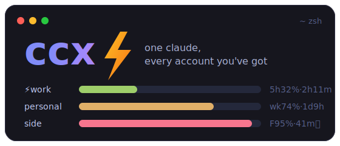

<p align="center">
  
</p>

<p align="center">
  <b>One <code>claude</code>, every account you've got.</b><br/>
  ccx juggles multiple Claude subscription accounts so you never stare at a rate-limit screen again.
</p>

<p align="center">
  <a href="https://github.com/brunoqgalvao/ccx/releases"></a>
  
  
  
  <a href="LICENSE"></a>
</p>

---

You know the moment. Deep in a session, context warmed up, and Claude Code says
**"limit reached, resets at 3 AM."** Meanwhile your other account is sitting
there at 4% usage, fully rested. So you `/logout`, `/login`, fish for the 2FA
mail, `--continue`, and swear you'll automate this someday.

**Someday is now.** ccx keeps every account's credentials in the macOS
Keychain, watches all three rate-limit gauges per account (5h session, weekly,
model-scoped weekly), and:

- 🚀 **`ccx`** — sticks with the active account while it's under 75% used,
  spills new sessions to a cooler account once it isn't (pinned via env token
  if another session is already running — the Keychain slot is never swapped
  under a live session), and tells you why
- 🔁 **swap & resume** — hit a limit mid-session? One `[Y/n]` and the same
  conversation continues on the other account (`claude --continue`, cache-aware:
  if the limit resets in minutes, it tells you to wait instead)
- 📌 **`ccx run work`** — pin a terminal to an account. Different terminals,
  different accounts, simultaneously; sessions that outlive their token
  refresh and resume themselves
- 📊 **statusline** — every account's gauges + time-to-reset, live inside
  Claude Code, with a 🔥 nudge when quota is about to reset unused:

  ```
  ⚡work 5h32%·2h11m wk49%·2d15h F81%✗ │ personal 5h8%·40m🔥 wk61%·6h22m F100%✗
  ```
- 🩺 **`ccx doctor`** — self-checks everything: keychain, tokens, endpoints,
  wiring

No proxy, no MITM, no telemetry: your tokens never leave the Keychain, and
switching happens at process boundaries. ~2k lines of Bun/TypeScript, zero
runtime dependencies, 129 tests.

> **Fair-use note:** ccx orchestrates accounts *you own and pay for* — think
> work + personal subscription. It is not a credential-sharing tool.

Design & rationale live in
[`docs/superpowers/specs/`](docs/superpowers/specs/2026-07-03-ccx-multi-account-orchestrator-design.md).
Headless auto-failover for `-p` mode and a launchd notifier are the next
milestone.

## Requirements

- macOS (credentials live in the macOS Keychain; there is no Linux/Windows path)
- [Bun](https://bun.sh) ≥ 1.0 (`curl -fsSL https://bun.sh/install | bash`)
- [Claude Code](https://claude.com/claude-code) installed and on `PATH`
- Two Anthropic subscription accounts you can `/login` to

## Install

```bash
git clone https://github.com/brunoqgalvao/ccx.git
cd ccx
bun install
bun link
which ccx   # should resolve to $HOME/.bun/bin/ccx
```

`bun`'s global bin directory is on `PATH` once bun itself is installed. If
`which ccx` comes up empty, add `export PATH="$HOME/.bun/bin:$PATH"` to your
`~/.zshrc`.

## Setup

```
1. claude   → /login as account 1 → exit
2. ccx import personal
3. claude   → /login as account 2 → exit
4. ccx import work
5. ccx doctor        # everything ✓
6. ccx status        # both accounts' gauges
```

Account names are whatever you pass to `ccx import` — they become the keys
of `state.accounts` and the `ccx-vault-<name>` Keychain services. There is no
separate "account names" config entry.

## Commands

| Command | Description |
|---|---|
| `ccx [claude args...]` | Default command. Sticky spillover pick: the active account keeps winning while its binding gauge (for the target model) is under `warningPct`; at `warningPct`+ the session goes to the best account still under the threshold (everyone hot → plain max headroom). A different pick activates via Keychain swap — unless another `claude` is already running, in which case the new session launches **pinned** via env token (`ccx run` mechanics) and the live slot is untouched. On exit: sync-back + failover assessment (Keychain-launched sessions only). |
| `ccx status [--json]` | Refreshes both accounts' snapshots and prints gauges, severities, reset times, and the active marker. |
| `ccx run <account> [claude args...]` | **Pinned session.** Launches `claude` with `CLAUDE_CODE_OAUTH_TOKEN` set to `<account>`'s vault token — the live Keychain slot is never touched, so multiple terminals can run different accounts simultaneously. Refreshes the vault token first if it has under `runMinTokenTtlMin` left, and verifies the token's identity before launching (an unverifiable token is refused, because claude silently falls back to the Keychain account otherwise). Pinned sessions bypass the picker, sync-back, and failover offer. |
| `ccx refresh` | Refreshes every parked vault token that has under `runMinTokenTtlMin` left (the live account is skipped — Claude Code manages that one). Exit 0 when nothing failed; built for a launchd/cron timer. |
| `ccx warm` | Starts any idle 5h window with a tiny silent ping (`warmModel`, default haiku). The 5h window anchors at your *first* request — warming means the next reset lands sooner during real work, and an unused window costs nothing. Run it from a launchd timer (~15 min). |
| `ccx swap [name] [-c]` | Switches the live Keychain slot (defaults to "the other account" when two are imported). `-c`/`--continue` resumes with `claude --continue` after swapping. Refuses if another `claude` process is running unless `--force` is also passed. |
| `ccx import <name> [--force]` | Captures the *current* live Keychain slot into vault entry `<name>`, fetching `account.uuid`/`email` via the profile endpoint. Used during setup and to recover a `needs-login` account after a fresh `/login`. |
| `ccx sync` | Manually copies the live slot back into its owning vault entry (normally runs automatically on launcher exit and on the next `ccx` invocation if a sync was deferred). |
| `ccx statusline` | Reads Claude Code's statusline JSON from stdin, merges it into the active account's snapshot, tees it to the onwatch bridge file, pipes it through the configured render command, and appends ccx's both-account segment. Wire it into `~/.claude/settings.json` (below). |
| `ccx doctor` | Self-checks: Keychain round-trip, live-slot readability, per-account vault + profile/usage endpoint reachability, blob-size headroom, `claude` on `PATH`, and whether the statusline is wired to `ccx statusline`. |

Optional alias migration (replaces the current bare-`claude` alias):
`alias cc="ccx"` — `--dangerously-skip-permissions` is already applied by
default (see `skipPermissions` below to opt out).

## Configuration

`~/.ccx/config.json` overrides any subset of these keys (defaults shown,
from `src/state.ts`'s `DEFAULT_CONFIG`):

| Key | Default | Meaning |
|---|---|---|
| `switchMinResetWaitMin` | `30` | Minutes. If every gauge that hit its limit resets within this window, ccx tells you to wait instead of offering a swap. |
| `pollMinIntervalS` | `300` | Seconds. Floor between usage-endpoint polls per account (also doubles as the 429 backoff). |
| `staleAfterMin` | `30` | Minutes. Snapshot age past which the picker/status mark data stale and try a fresh poll before using it. |
| `tiebreakMargin` | `5` | Percentage points. Headroom difference within which the picker tiebreaks on soonest-reset instead of raw headroom. |
| `warmModel` | `"haiku"` | Model for `ccx warm`'s window-starting ping — cheap, and never touches the model-scoped pool. |
| `warningPct` | `75` | Percent usage at/above which a gauge is `warning` severity (statusline-sourced gauges only — the usage endpoint reports its own severity). Also the launch spillover threshold: new sessions leave the active account once its binding gauge crosses this. |
| `criticalPct` | `95` | Percent usage at/above which a gauge is `critical` severity (statusline-sourced gauges only). |
| `downgradeModel` | `"opus"` | Model passed to `claude --continue --model <this>` when both accounts' scoped (Fable) pools are topped but general quota remains. |
| `statuslinePassthrough` | `"bun x ccusage statusline"` | Command `ccx statusline` pipes the raw stdin JSON through and renders first, before appending ccx's segment. |
| `statuslineTeePath` | `~/.onwatch/data/anthropic-statusline.json` | Where the raw statusline JSON is teed for onwatch's bridge (preserves the existing onwatch integration). |
| `claudeCodeUaVersion` | `"2.1.199"` | `User-Agent` version string sent to the usage/profile endpoints (they're unofficial and version-sensitive). |
| `skipPermissions` | `true` | Appends `--dangerously-skip-permissions` to every `claude` spawn (launch, failover resume, `swap -c`, `run`). Set `false` to keep Claude Code's permission prompts. |
| `runMinTokenTtlMin` | `360` | Minutes. `ccx run` and `ccx refresh` refresh a vault access token when it has less than this long left. |
| `statuslineBasic` | `true` | Renders the session's own basics (`Fable 5 · ctx 9% · med` — model, context used, effort) ahead of the accounts segment; ctx gets a `!` at 80%+. |
| `statuslineEta` | `"line2"` | Where reset countdowns render: `"line2"` = dedicated second statusline row (`↻ work 5h 3h2m · wk 2d15h`), `"inline"` = appended per gauge (`5h7%·3h2m`), `"off"` = hidden. |
| `expiryNudgeMin` | `60` | Minutes. A gauge resetting within this window while unused headroom remains gets the 🔥 use-it-or-lose-it nudge (statusline + `ccx status`). |
| `expiryNudgeUnusedPct` | `25` | Percentage points of unused quota below which the 🔥 nudge is not worth showing. |

`~/.ccx/state.json` is ccx's own runtime state (active account, per-account
snapshots, `sync_pending`, notifier throttle history) — no secrets, mode
`0600`. If it's corrupt or missing, ccx falls back to an empty state and
**fails safe**: your token pairs stay untouched in the `ccx-vault-*`
Keychain entries (guards refuse to overwrite anything they can't verify),
but ccx no longer knows your account names. Recovery is manual: `ccx import
<name>` re-registers the account that's currently logged in, and the other
account needs a `claude` → `/login` → `ccx import <other> --force` round
trip. There is no automatic Keychain-enumeration rebuild in the MVP.

## Pinned sessions (`ccx run`) and proactive token refresh

`ccx run <account>` sidesteps the single-live-slot model entirely: the session's
account is baked in at launch via `CLAUDE_CODE_OAUTH_TOKEN` and never reads the
Keychain again. Run `ccx run work` in one terminal and `ccx run personal` in
another — "swapping" one of them is just exiting it and relaunching with
`ccx run <other> -- --continue`; the other terminal never notices, and the
concurrency guard doesn't apply.

A running pinned session cannot rotate its own env token, so `ccx run` covers
the expiry wall from both sides:

- **Refresh at launch** — the vault token is refreshed when it has less than
  `runMinTokenTtlMin` left, so every session starts with a full window.
- **Auto-resume on auth death** — if an interactive pinned session exits
  *after* its token's expiry time (the signature of dying to an expired
  token), ccx refreshes the token and relaunches with `--continue`
  automatically; the conversation carries on. One-shot `-p`/`--print` runs
  and non-TTY contexts are never auto-resumed, and an exit while the token
  is still valid is treated as intentional.

To also keep parked tokens warm around the clock, add a launchd timer for
`ccx refresh` (`~/Library/LaunchAgents/dev.ccx.refresh.plist`). Note the
explicit `PATH`: launchd doesn't read your shell profile, and the `ccx`
launcher needs `bun` on `PATH` for its shebang:

```xml
<?xml version="1.0" encoding="UTF-8"?>
<!DOCTYPE plist PUBLIC "-//Apple//DTD PLIST 1.0//EN" "http://www.apple.com/DTDs/PropertyList-1.0.dtd">
<plist version="1.0"><dict>
  <key>Label</key><string>dev.ccx.refresh</string>
  <key>ProgramArguments</key><array>
    <string>/Users/YOU/.bun/bin/ccx</string><string>refresh</string>
  </array>
  <key>EnvironmentVariables</key><dict>
    <key>PATH</key><string>/Users/YOU/.bun/bin:/usr/local/bin:/usr/bin:/bin</string>
  </dict>
  <key>StartInterval</key><integer>14400</integer>
  <key>StandardOutPath</key><string>/tmp/ccx-refresh.log</string>
  <key>StandardErrorPath</key><string>/tmp/ccx-refresh.log</string>
</dict></plist>
```

Load it with `launchctl load ~/Library/LaunchAgents/dev.ccx.refresh.plist`.

## Statusline wiring

Replace your current statusline command — the `tee ... | bun x ccusage
statusline` chain — with `ccx statusline`; it does both (tees to the same
onwatch bridge path *and* pipes through the same render command) and adds a
both-account gauge segment on top:

```json
{ "statusLine": { "type": "command", "command": "ccx statusline" } }
```

Segment anatomy:

```
⚡meistrari 5h15% wk49% F81%✗ │ pqg 5h0% wk61% F100%✗
↻ meistrari 5h 3h2m · wk 2d15h │ pqg wk 6h22m
```

`⚡` marks the active account; each gauge shows percent used, `!` warning /
`✗` critical-or-active-limit, `?` stale data, and 🔥 when the window resets
soon with plenty unused — quota doesn't roll over, so burn it. The `↻` second
row shows time-to-reset per running window (a window that hasn't started —
zero spend — has no reset scheduled, so it's omitted). Countdown placement is
the `statuslineEta` config: `line2` (default), `inline`, or `off`.

Edit `~/.claude/settings.json` yourself — ccx does not modify it (`ccx
doctor` reports whether it's wired, but only reads the file).

## Failure recovery

- **`needs-login`** — the direct token-refresh call for a parked account got
  `invalid_grant` (the refresh token is dead). Recovery: `claude` → `/login`
  as that account → exit → `ccx import <name> --force`. `ccx swap` to that
  account also heals it (Claude Code refreshes natively on next launch).
- **`sync_pending`** — after a session, `resolveOwner()` couldn't determine
  which vault entry owns the live slot's rotated tokens (typically offline,
  or a 401 that survived a refresh retry). Rather than guess and risk
  clobbering the wrong vault entry, ccx defers the sync-back and sets this
  flag; it retries automatically on the next `ccx` invocation (any
  subcommand except `statusline`), or run `ccx sync` to retry immediately.
  While pending, `ccx swap` refuses to activate anything — the live slot
  holds rotated tokens not yet captured anywhere, and overwriting it would
  brick that account until interactive re-login.

## Failover policy (cache-aware)

When the just-used account hits a hard limit, ccx only offers to swap if
the hit gauge(s) do *not* all reset within `switchMinResetWaitMin` (default
30 min) — if they do, waiting is cheaper than paying for an uncached context
re-read on the other account. If waiting isn't worth it and the other
account has headroom, ccx offers to resume there with `claude --continue`
(or, when both accounts' Fable pools are topped but general quota remains,
with `--continue --model opus` as a downgrade offer); otherwise it prints
the soonest reset time and exits.

## Honest test-coverage note

The failover *decision policy* (`assessFailover` in `src/failover.ts`) is
thoroughly unit-tested against fake snapshots and clocks. The *wiring around
it* — `runLaunch`, `offerFailover`'s `[Y/n]` prompt, `runSwap`, and the
`--continue` respawn — is an I/O shell with **no unit tests**; it is
verified by inspection and by the First-run checklist below. And nothing has
been exercised end-to-end against a real rate limit — that requires actually
burning a real account's quota. Treat the policy as unit-verified and the
prompt/resume plumbing as field-unverified until the first real limit hit
confirms it. (Headless auto-failover does not exist yet — it's Milestone 3.)

## Debugging note

`ccx statusline` calls `Bun.stdin.text()` unconditionally — it reads until
stdin closes (EOF). Run it directly on a bare interactive terminal with no
piped input and it will hang forever (no EOF, no error). Always test it
with piped input, e.g. `echo '{}' | ccx statusline`, or let Claude Code
invoke it as the configured `statusLine.command`.

## First-run verification (not yet performed)

This is the manual E2E checklist from the plan. It is the only part of
`ccx` that touches real credentials and real accounts, and it has **not**
been run yet — that is out of scope for this change and left to the human
operator. Perform in order; each line must pass before the next:

1. `ccx doctor` → keychain round-trip ✓, claude on PATH ✓.
2. `ccx import <name-for-current-login>` → prints the account email.
3. `ccx status` → live gauges for that account (compare against `/usage` in claude).
4. In `claude`: `/login` to the second account, exit. `ccx import <other-name>`.
5. `ccx status` → both accounts, correct distinct gauges.
6. `ccx swap` → flips active; `claude` (bare) → verify with `/status` it's the other account. `ccx swap` back.
7. `ccx swap -c` → resumes the most recent conversation on the other account.
8. `ccx` (launch) → lands on the higher-headroom account (check the printed reason).
9. Wire statusline per README; start a session; verify the segment shows both accounts and `ccx status` reflects statusline-fresh data (source: statusline).
10. `ccx sync && ccx doctor` after a long session → all ✓ (proves rotated-token capture).
11. With a claude session open in another terminal: `pgrep -x claude` prints a PID, and `ccx swap` refuses without `--force` (validates the concurrency guard's process detection).

Once run, results (date + any deviations) belong in a `## E2E verified`
section appended here — not added by this change.
